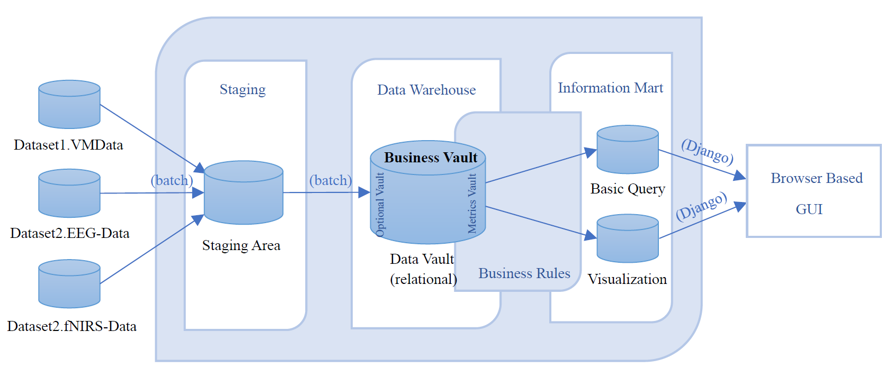
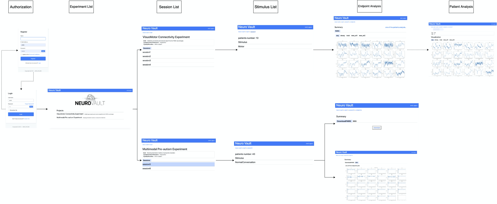

# Neuro Images Data Vault

This project follows Data Vault2.0 architecture to design and build, which aims to move complex business rules towards the end-user in order to ensure quick adaption to changes. More detail knowledges can read this book: [*Building a scalable data warehouse with data vault 2.0*](https://books.google.co.uk/books?hl=en&lr=&id=lgDJBAAAQBAJ&oi=fnd&pg=PP1&dq=building+a+scalable+data+warehouse&ots=V_RyFvP1ow&sig=x3pcFwlf1l3Wm6LrfR_jXSWEQm0&redir_esc=y#v=onepage&q=building%20a%20scalable%20data%20warehouse&f=false), written by Linstedt and Olschimke.

There are three main layers in this session.

1. **Staging area**: Extract and store data from the source, this layer doesn't have memory, so it won't keep history data, The data types follow the intended data type from the source system. This layer primary purpose is to reduce the workload on the operational systems by loading all required data into a separate database first, the another purpose is to compute and add system-generated attributes.
2. **Data Vault**: This layer is mainly for transformation. The important property is the business keys, which is used to indicate the how businesses integrate, connect, and access information in the systems. There are three entity types: hubs (seperate the bussiness keys), links (store relationships), and satellites (store the attributes of a business key or relationship). Besides, there are business vault where business rules have been applied (business rules change with time and regions)
3. **Information Mart**: This layer is subject oriented, can be in aggregated form, flat or wide, prepared for reporting, highly indexed, redundant and quality cleansed. It often follows start schema forms and can write-back information to meet needs. There includes Error Mart, Meta Mart as well

 
 

Below are our project results, which may have some drawbacks, but it did give us a lot to learn.

1. Data vault architecture (three layers + GUI)

2. database model diagram in the second layer: data vault

3. Rudimentary visual GUI system created with Django

